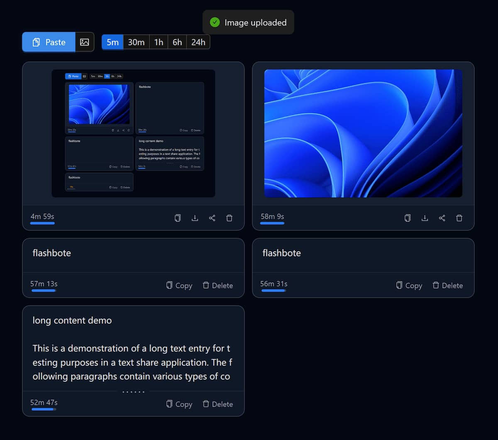

<div align="center">
    

# Flash Note

<div>
    <a href="https://github.com/Mmx233/flashnote/blob/main/LICENSE">
        
    </a>
    <a href="https://goreportcard.com/report/github.com/Mmx233/flashnote">
        
    </a>
</div>
<div>
    <a href="https://github.com/Mmx233/flashnote/releases">
        
    </a>
    <a href="https://hub.docker.com/repository/docker/mmx233/flashnote">
        
    </a>
</div>

Self-hosted ephemeral text & image sharing. Paste to upload, one-click copy, auto-expire. Single binary, zero external dependencies.

<p></p>

</div>

## Features

- **Paste-first** — Ctrl+V anywhere to upload text or images
- **Real-time sync** — WebSocket pushes changes to all connected clients instantly
- **Auto-expire** — Every clip has a TTL; expired content is cleaned up automatically
- **Single binary** — Frontend is embedded via `go:embed`, just run and go
- **Dark mode** — Follows system preference, no toggle needed
- **Image actions** — Copy to clipboard, download, share (Web Share API)

## Quick Start

### Docker

```bash
docker run -d \
  -p 8080:8080 \
  -v ./data:/data \
  -v ./config.yaml:/config.yaml \
  mmx233/flashnote
```

### Binary

Download the latest binary from [Releases](https://github.com/Mmx233/flashnote/releases), then:

```bash
cp examples/config.yaml config.yaml
./flashnote
```

Open `http://localhost:8080` in your browser.

### Build from Source

```bash
git clone https://github.com/Mmx233/flashnote.git
cd flashnote
cd web && yarn install && yarn build && cd ..
go build -o flashnote .
```

## Configuration

Create a `config.yaml` in the working directory (or specify with `-c`). See [`examples/config.yaml`](examples/config.yaml) for a full example.